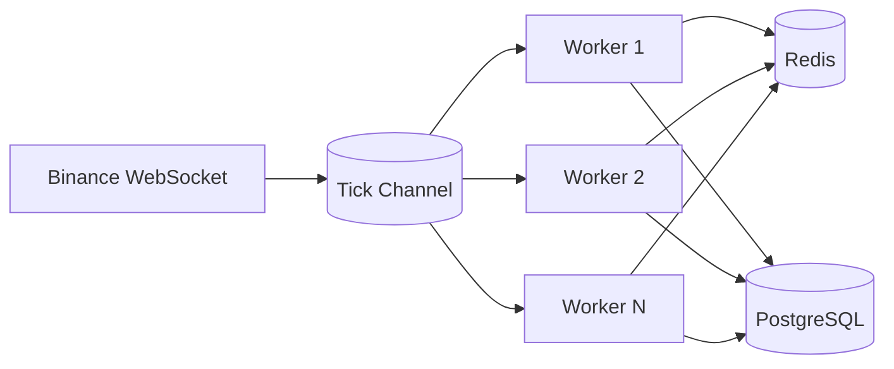
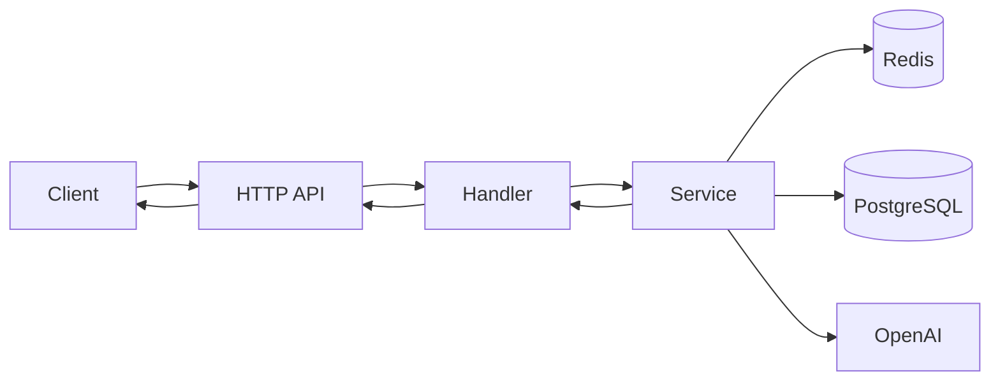

# 🚀 Go AI Trading Engine

[](https://go.dev/)
[](https://www.docker.com/)
[](https://www.postgresql.org/)
[](https://redis.io/)
[](https://developer.mozilla.org/en-US/docs/Web/API/WebSockets_API)
[](https://platform.openai.com/)

A production-grade Go backend for **real-time crypto market ingestion**, **low-latency price serving**, and **AI-powered trading insights**. Built with clean architecture, concurrent workers, and scalable infrastructure patterns.

Designed to handle high-throughput, low-latency trading workloads (2M+ users scale).
## Features

- Real-time Binance WebSocket ingestion (`BTCUSDT` by default)
- High-throughput processing with goroutines + worker channels
- REST APIs for latest prices and AI trading queries
- OpenAI integration for contextual market analysis
- Redis caching for ultra-fast latest/recent price access
- PostgreSQL persistence for ticks and AI query logs
- Structured logging, panic recovery, graceful shutdown
- Basic IP rate limiting middleware
- Dockerized deployment with `docker-compose`

## Architecture Overview

The system follows clean architecture with clear separation of concerns:

- **Handler**: HTTP transport layer
- **Service**: Business logic and orchestration
- **Repository**: Data access abstraction (Redis/Postgres)
- **Infrastructure**: External integrations (Binance WS, OpenAI)

## Real-Time Processing Flow



## API Request Flow



## Tech Stack

- **Language**: Go
- **Transport**: REST + WebSocket client
- **Cache**: Redis
- **Database**: PostgreSQL
- **AI**: OpenAI API
- **Containerization**: Docker, Docker Compose
- **Observability**: Structured JSON logging (`slog`)

## Project Structure

```text
.
├── cmd/server/                  # Application entrypoint
├── internal/
│   ├── app/                     # Dependency injection container
│   ├── config/                  # Config loader (env-based)
│   ├── domain/                  # Entities + interfaces
│   ├── handler/http/            # HTTP handlers/routes
│   ├── infrastructure/wsclient/ # Binance WebSocket client
│   ├── middleware/              # Rate limiter, logging, recovery
│   ├── repository/
│   │   ├── postgres/            # Persistent storage
│   │   └── redis/               # Cache storage
│   └── service/
│       ├── market/              # Market data processing
│       └── ai/                  # AI query orchestration
├── Dockerfile
├── docker-compose.yml
└── .env.example
```

## Setup

### 1. Configure environment

```bash
cp .env.example .env
# set OPENAI_API_KEY in .env
```

### 2. Start with Docker Compose

```bash
docker compose up --build
```

App runs on `http://localhost:8080`.

## API Endpoints

- `GET /api/v1/prices/latest?symbol=BTCUSDT`
- `POST /api/v1/query`
- `GET /health`

## Example Requests & Responses

### Get Latest Price

**Request**
```http
GET /api/v1/prices/latest?symbol=BTCUSDT
```

**Response**
```json
{
  "symbol": "BTCUSDT",
  "price": 75099.4,
  "trade_id": "6235648160",
  "event_time": "2026-04-20T10:54:28Z",
  "source": "binance_ws"
}
```

### Ask AI Trading Assistant

> Note: OpenAI integration requires API credits to function.

**Request**
```http
POST /api/v1/query
Content-Type: application/json
```

```json
{
  "user_id": "user-123",
  "symbol": "BTCUSDT",
  "message": "Should I buy BTC right now?"
}
```

**Response**
```json
{
  "answer": "Bias: neutral (58/100). BTC is near short-term resistance with mixed momentum. Consider waiting for confirmation and use tight risk controls. This is not financial advice.",
  "generated_at": "2026-04-20T10:55:12Z"
}
```

## Concurrency Model

- A buffered channel receives trade ticks from Binance WebSocket.
- Multiple worker goroutines consume ticks concurrently.
- Each worker updates Redis (latest + rolling history) and persists to PostgreSQL.
- This model improves throughput, isolates slow I/O, and keeps API reads low-latency.

## Future Improvements

- AuthN/AuthZ + per-user quota and rate limits
- OpenTelemetry tracing + Prometheus metrics
- Circuit breaker/retry policies for OpenAI calls
- Versioned SQL migrations
- Multi-symbol and multi-exchange ingestion
- Backtesting and strategy plugin framework

## License

MIT License.
